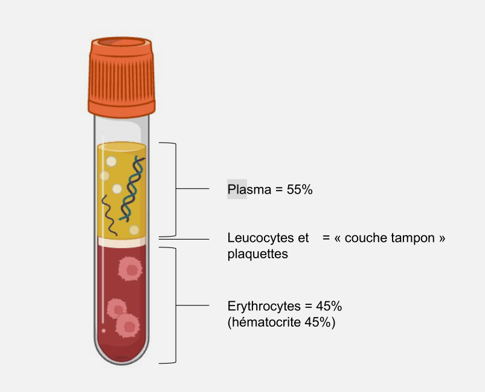

# Composition du Sang

## Introduction 

On a surtout étudier les **tissus solides** l'année dernière, composés de cellules reliés entre elles par des *jonctions*, *membranes*... Mais **le sang est aussi un tissue**, alors qu'il est **liquide** !

*Cela implique donc une composition particulière* pour qu'il puisse être considéré comme un tissue et être liquide à certain moments

Dans ce premier chapitre, nous étudirons surout la **composition du sang.** Nous verrons ses propriétés dans le prochain chapitre.

Nous avions vu l'année dernière l'importance d'avoir plusieurs organes *spécialisés*. On avait vu que ces organes pouvait être spécialisés car leurs **tissues** étaient spécialisés et donc les **cellules** aussi.

*Cependant, les échanges entre organisme et exterieux ne peuvent passer que par l'exterieur car cette spécialisation rend chaque organe unique.* Dans les poumons, les intestings grèles, ..., l'epaisseur est fine, la surface très grande et la différence de gradien très élevée. 

Nous avons également vu que le coeur, et donc le sang, relie tout ces organes. Il assure également un **transport** des molécules.

Notre corps possède 3 liquides transporteurs :
1. Le **Sang**
2. La **Lymphe**
3. Le **Liquide Interstitiel** (entre les cellules)

Ces liquides ne sont pas indépendants mais **interdépendants** (idée de *vases communiquants*). C'est le **milieu interieur**.

### Détour sur la Lymphe

La lymphe circule dans un **réseau ouvert**, le réseau lymphatique. Il reste ouvert entre les cellules pour se déplacer et récupérer le liquide de l'autre coté.

*La lymphe rentre dans le réseau lymphatique via filtration, donc rien d'autre ne peux rentrer dedans.* La lymphe se déverse toujours dans un sens vers la **veine cave** *superieur*. Sa composition est proche du plasma sanguin.

> [!INFO]
> Le déplacement de la lymphe est 3000x moins rapide que le sang du à l'absence de pompes. Il est déplacé par les mouvements des muscles qui pressent sur ele résau.

La lymphe a 4 fonctions principales :

1. Le tranfert du liquide interstitiel
2. Drainer les protéines du milieu interstitiel
3. Transport des microns
4. Transport des loycocites (globules blancs) et mise en contact avec l'antigène

#### Quels sont les différents constituants du sang ? Comment les composantes du sang partucupent-ils à l'intégrité de l'organisme ?

## Composition du sang

| Le sang est composé de - *55%* de **Plasma**, un liquide de soluté variable, de l'eau (90%), avec protéines (8%)[^1] - *45%* d'**Erythrocytes** (**globules rouges**) proportion d'élément figurés, donc de **celulles** type **hématrocite** - Ainsi qu'une **couche tampo** forme de **leucocytes** (**globules blancs** et autre, voir si dessous) |  |
| -------------------------------------------------------------------------------------------------------------------------------------------------------------------------------------------------------------------------------------------------------------------------------------------------------------------------------------------------------------- | ------------------------- |

Au delà des globules rouges, le tampo contient également plusieurs molécules importantes dont :

1. Les Leucocytes
	- Granulocytes neutrophiles
	- Granulocytes éosinophiles
	- Granulocytes basophiles
	- Lyphocytes
	- Monocytes
2. Les Plaquettes

### Globules rouges

Rappel de l'année dernière : ils transportent le dyoxigène et le dyoxide de carbone. Les globules rouges possèdent une durée de vie de ~120 jours. Elle doivent donc êtres fréquement renouvelés. Elles sont détruites dans la rate et dans le foix pour former de la bilirubine qui donne la couleur jaunatre au plasma. Le fer, aussi contenu dans l'hémoglobine, sous forme de ferratine, sera recyclé et transporté par le sang via transférine à la moelle osseuse qui va reproduire les globules blancs.

Pour récupérer leur énergie, les globules rouges **n'utilisent pas de mithocondries** car elle consomme de l'$O_2$ alors qu'elle shouaite la conserver. Les globules rouges utilisent donc la **fermentation** *lactique* pour obtenir quelques ATP. *Le lactate est ensuite expulsé et récupéré par le fois*. On remarque donc une **ultra-spécialisation** de la cellule d'hémoglobine

On trouve donc 250 Millions de molécule d'hémoglobine par [Éléctrocyte](../../definitions.md#Éléctrocyte).

Enfin, il y a une régulation de la production de globule rouge conrolée. *Le pourcentage d'hématrocyte ne sera pas dépassé.* La production est régulée par la moelle osseuse elle mêm et des hormones, la **Érithropoïétine**. Cette hormone peut donc permettre plus de globules rouges donc plus d'oxygène (dopage chez les atlètes).

## Prévention des pertes sanguines : **Hémostase**

...

[^1]: Dont **Albumine** (pression pour préserver l'équilibre entre liquide interstitiel et plasma), **Glouline A & B** (protéines vectrices au lipides, ions métaliques, vitamines), **GlobulineG** (anticorps), *Facteurs de coagluations* et autre. Voir liste complète sur le poly.
