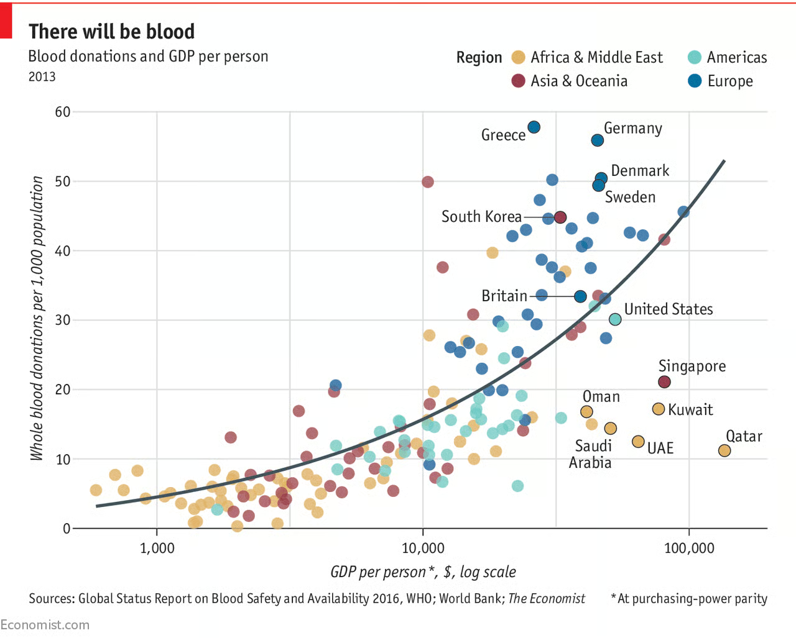
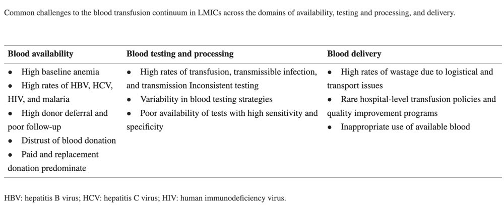

# 🇬🇧 English

## *Questions: Why is the blood vital for human organism and what is it's availability around the world? Which are the current and futur solutions to answer the blood shortage in the worldwide ?*

## Introduction on blood

**Blood** is a fluid lead on plasma that transports oxygen and nutrients to the cells and carries away carbon dioxide and other waste products. It also carries **red blood cells**, **white blood cells** and **patelets**.

Blood is a transport liquid pumped by the heart to all parts of the body, after which it is returned to the heart to repeat the process.

**Blood is both a tissue and a fluid.** It is a tissue because it is a collection of similar specialized cells that serve particular functions.

As blood carries oxygen & carbon dioxide, it's a **vital tissue for the human body**. As we saw in [[ch1#Globules%20rouges|"Globules Rouges" section from last chapter]], the human blood have a quite long regeneration time and so **need to be given in case of blood loss**.

The most common blood type is **A+** in northen europe and **O+** in UK & United States

We can clearely see a gap between sourthen countries & european / developed countries : over a 500% increase for Germany, Greece & Sweden copared to Arbia, Qatar, UAE…

**WE COULD GIVE CELLS OR PLASMA INDIVUDUALLY INSTEAD OF FULL BLOOD**

Poore countires have different donated blood usage than in Europe : while developed countires gives their blood to older peoples, poorer countires give it to childs under 5.

54 countries collect more than 50% of their blood supply from family/replacement or paid donors.

---

1. Is the volume of donated blood constant over the time? **NO!** 

2. Which factors can/or do influence the blood donations? *Depending of appeals, blood supply can be bigger or not.*

3. Watch the two publicities. In your opinion are these publicities efficient? Why? *They use the feeling of solidarity which could not be undesrtand by some peoples. But the saving life things make peoples feels important, which according to HEC is very important.*

4. The second publicity targets specific populations. Link the publicity to the documents in the introduction and explain this targeting. *Peoples origining from poorer countries*

5. Define blood transfusion continuum. *Continuity of blood donation or transport chain?*

6. Would you say that blood transfusion is a safe process? Discuss this point. 

7. Conclude wether the blood donation is a sufficient solution for the blood need worldwide? **NOPE**

1. Explain the existence of the different blood types from a molecular point of view. 

2. What is hemagglutination and how does it occur ? 

3. Interpret the results of the blood typing presented in the table. 

4. Explain the necessity of blood typing before a transfusion. 

5. Explain the termes "universal donor" and "universal receiver". 

6. Compare the genetic sequences of the different blood type determining alleles. 

7. Study the composition and the biosynthesis of the different blood antigens.

8. Explain the existence of different blood types from genetic point of view.

|     | **A**  | **B**  | **O**  |
| :-: | :----: | :----: | :----: |
|  **A**  |   x    | 99.62% | 99.91% |
|  **B**  | 99.62% |   x    | 99.53% |
|  **O**  | 99.91% | 99.53% |   x    |

9. Answer the overall question. 

## Genotypes

### Alan

- Allan should have a genotype of A || B → [AB]
- Monica should have a genotype of A || O → [A]
- Rick should have a genotype of (A || B &&  O) → [A], [B], [AB] but NOT O (would require O type)

### Biosynth of blood antigens

You need, to fix fluctose, lactose and more to the blood cell **an enzyme**. An enzyme H is needed to create substance H and stick it to the blood cell (and enzyme A/enzyme B to add the last part from allele A or B)

Blood type can depend on a gene while other genes are present: a or b can be here but no gene H make O

(*Gene H is called Tut1*)

So **A & B are dominant over O** unless enzyme H is not present (*which is not a gene from O*)
