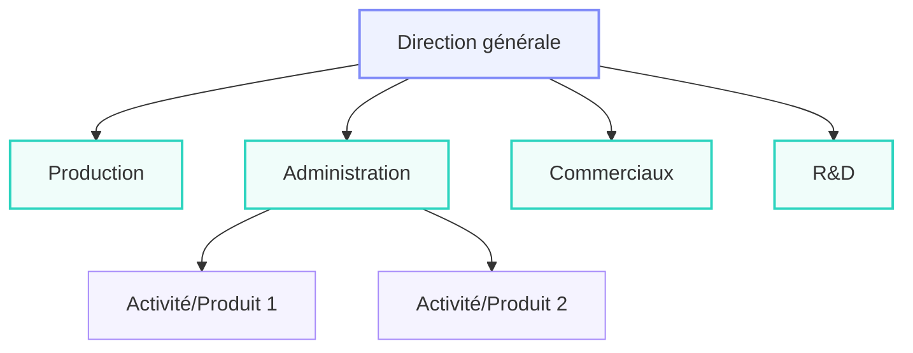
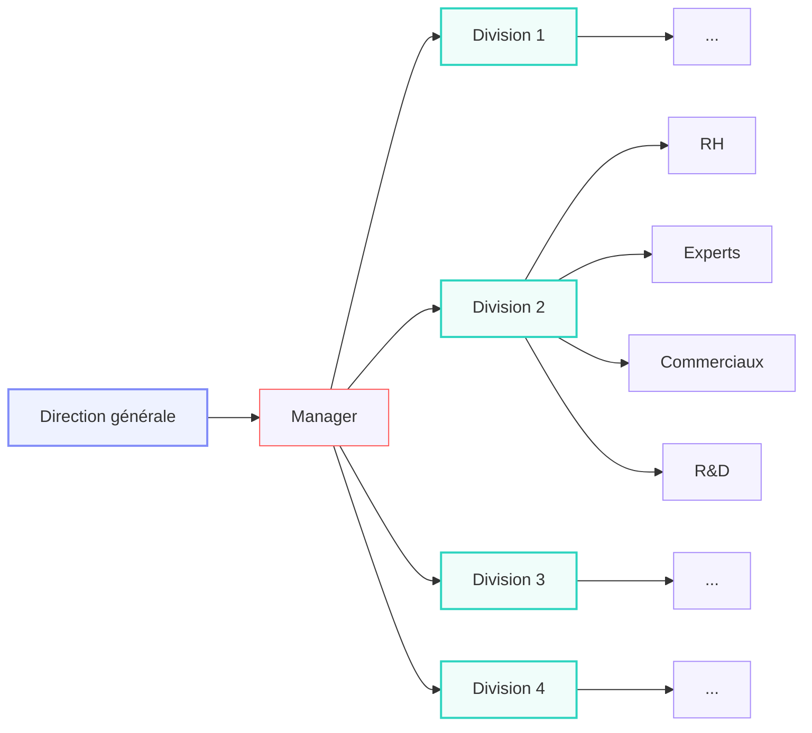

# 🐟 Fish Mi-S1

## Chapitre 1 : Entreprises et Gouvernances

### Intro :

#### Premiers éléments de définition

- **unités légales de décision autonomes**
- **profit** (pas forcément maximisé)
- **production marchande**

| 🇫🇷 France (Insee)                                              | 🇬🇧 United Kingdom (ONS)                               |
| ---------------------------------------------------------------- | ------------------------------------------------------- |
| Microentreprises (-10e et -2M€/an)                              | Microentreprises (-10e)                                |
| Petites entreprises (-50e)                                       | Small entreprises (-50e)                                |
| PME (Petites et Moyennes Entreprises) (-250e et -50M€/an) | SMEs (Small and Medium-Sized entreprises) (-250e) |
| Entreprises de Taille Intermédiaire (ETI)                       |                                                         |
| Grandes Entreprises (GE)                                         | Large entreprises                                       |

#### L’entrepreneur capitaliste

> Jacques Turgot

- Chef de famille (patriarcat)
- Sous sous

À partir de l'âge de la métallurgie, il faut réunir plus de capital (famille + famille). On crée alors de nouveaux statuts légaux :

- Les **SNC** (Sociétés en Nom Collectif) : des entrepreneurs capitalistes s'associent pour avoir plus de capital (unir des familles autrement que par le mariage)
- Les **SC** (Sociétés en Commandite) : équivalent des SNC, mais possèdent une *identité juridique*. **Introduction des liquidations judiciaires.**
- Les **SA** (Sociétés Anonymes) : équivalent des SNC, mais des personnes étrangères à l'entreprise peuvent investir dedans. *On peut alors découper le capital en actions.*
  → *En anglais : Public Limited Company*
- Les **SARL** (Sociétés à Responsabilité Limitée) : certains investisseurs sont à l’intérieur de l'entreprise. *Entre-deux entre SA et SNC.* Arrive en France en 1925.

#### L’entrepreneur innovateur/**schumpétérien**

> Schumpeter

- Importance de l'idée, de l'innovation, de la prise de risque
- Innovations par « grappes »

#### L’existence de la firme chez les néoclassiques

> Ronald Coase

- L’entreprise comme une « boîte noire » dans la théorie néoclassique (modèle du producteur).
  → On ne regarde que l'output, pas comment il est fait
- Utiliser le marché demande du temps
  **→ coûts de transaction** : le marché n'est pas gratuit ! temps, négo, contrats...

### I – Le développement de la grande entreprise et de sa gouvernance

#### La division du travail au sein des entreprises

##### L’organisation scientifique du travail

- taylorisme (one best way)
- fordisme (travail à la chaine)
- toyotisme (règle des 5 zéros)
	1. 0 défaut (*pas de retours*)
	2. 0 papier (*bureaucratie/managérial*)
	3. 0 arrêt (*pas d'arrêt de la chaîne de travail*)
	4. 0 stock *(production directe, donc pas de coût d'entrepôt)*
	5. 0 délai (*production en fonction de la demande*)
    → Avis de l'ouvrier

##### Les formes d’organisation de l’entreprise productive : **unitaires** et **multidivisionnelles**

#### Le rôle de la hiérarchie

##### L’arbitrage entre making et buying

- coûts de transaction et coûts d'organisation interne

![[Pasted image 20261003104731.png|376]]

> **Coûts de transaction** vs **Coûts d'orga interne**

|                                  | **Marché**    | *Hybride*      | **Hiérarchie**    |
| -------------------------------- | ------------- | -------------- | ----------------- |
| Capacité d'adaptation autonome   | ++            | +              | 0                 |
| Capacité d'adaptation coordonnée | 0             | +              | ++                |
| Intensité de l'incitation        | ++            | +              | 0                 |
| Degré de contrôle administratif  | 0             | +              | ++                |
| **Type de contrat**              | **Classique** | *Néoclassique* | **Subordination** |

##### Les managers dans l’entreprise

> Alfred Chandler (1977), *The Visible Hand*

Ces différentes approches préparent l'analyse *incontournable* d'**Adolf Berle & Gardiner Means** sur les **managers**.

Paul Delorme (puis Jean Delorme), patron d'Air Liquide, possède 80 % des actions au XXe siècle. Il perd peu à peu le capital, jusqu'à finalement être expulsé de l'entreprise en 1953.

**On observe donc un passage du pouvoir du propriétaire familial au manager.**

### II – Les différents modes de financement des entreprises et leur gouvernance

#### Modes de financement et structures économiques

##### Le développement du financement externe au XIXe siècle

###### Le développement du financement indirect

- XIXe siècle : **financement extérieur peu utilisé** pour des raisons d'éthique et de manque d'offre (et de demande).
- La révolution industrielle **demande à être financée**
	- les « high banks » se développent au Royaume-Uni.
	- Création de banques centrales (Belgique, première en Europe)
	- Des banques mixtes collectent l'épargne et la réinvestissent.

En France, on a rejeté ce système pendant longtemps. **Henry Germain**, le fondateur du **Crédit lyonnais (LCL)**, *banque de dépôt uniquement*, dit que la sécurité d'une banque de dépôt est incompatible avec celle des entreprises industrielles. Les banques mixtes arrivent à la fin du XIXe siècle.

###### Le développement du financement direct

Entreprises en bourses
- Londres en 1850: ~100
- Paris en 1900: ~ 1 100.
→ Pas beaucoup

> L'auteur montre comment la croissance industrielle des pays riches a favorisé l'apparition du sous-développement ailleurs.
> Je fait quoi avec ça ?

![[Pasted image 20261004165919.png]]

##### La justification économique du recours aux modes de financement externes

- 
- +rapide que les banques, car moins d'informations à avoir/demander (une banque ne prête pas à n'importe qui)
- défaut : pas d'info = freerider. Bulles de spéculations.

##### Quel mode de financement pour quelle structure de l’économie ?

> [!info] Rappel
> On revient sur les systèmes de M0/M1/M2/M3 que nous avons vus l'année dernière.
>
> 1. **M0** : la monnaie la plus liquide, réserve de la banque centrale
> 2. **M1** : l'argent sur les comptes en banque, les **dépôts à vue**
> 3. **M2** : l'épargne mobilisable sous moins de 3 mois
> 4. **M3** : monnaie mobilisable en moins de 2 ans.
>
> Il existe deux approches :
> - **M0** → **M3** : Multiplicateur de crédit
> - **M3** → **M0** : *Diviseur monétaire keynésien*. Approche par la demande qui se répercute sur la banque centrale.

x

#### Les limites de la séparation entre la propriété et la gestion de l'entreprise

##### La divergence des objectifs entre les acteurs de l’entreprise

Intérêts divergents entre les managers et les actionnaires

##### La théorie de l’agence

- conflit d'interet
- changement d'avis après contrat (divergence morale)
- asymétrie d'informations

##### Manager ou contrôler ?

Équilibre pour ne pas exclure ni actionnaires ni managers

| Stage of the decision process | Function/dimension | Actor assuming the function |
| :---------------------------: | :----------------: | :-------------------------: |
|          Initiative           |      Decision      |     Executive Managers      |
|        *Ratification*         |     *Control*      |    *Board of directors*     |
|        Implementation         |      Decision      |     Executive Managers      |
|         *Monitoring*          |     *Control*      |    *Board of directors*     |

### III – Grandes transformations depuis les années 70 et la financiarisation de l'économie

#### Les grandes ruptures du système financier

##### Éléments historiques : les Trente Glorieuses et leur chute

- Rappels sur les crises associées aux chocs pétroliers des années 1970
	- Guerre israélo-arabe de 1973 (guerre du Kippour/Ramadan).
	- Révolution iranienne de 1979.
- La grande période de concentration et l'apogée du modèle taylorofordiste
	- Influence de l’économie de guerre
- Le New Deal post-crise de 1929 et l'internationalisation de la production mondiale
	- GATT (General Agreement on Tariffs and Trade) en 1947.
	- CEE (Communauté Économique Européenne) en 1957.

**Début du libéralisme économique avec la réforme Debré-Haberer en France.**

#### La gouvernance des entreprises dans un capitalisme financiarisé

##### Le néolibéralisme et la financiarisation de l’économie

- Historique du néolibéralisme
	- Rappel : Néolibéralisme → moins de participation de l'État
	- 1980 : **Ronald Reagan** (US) & **Margaret Thatcher** (UK) → dérégulation financière, affaiblissement des syndicats, baisse des impôts
	- France : 83, relance Mauroy échoue, **tournant de la rigueur** → engagement dans la dérégulation financière
- L'analyse d'Henri Bourguinat (1992, *Finance internationale*)
	- Règle des 3-D
		1. Dérégulation
		2. Décloisonnement
		3. Désintermédiation

Baisse du taux d'intermédiation → plus de financement via la Bourse (autres marchés, voir juste après).

#### Une nouvelle division du travail entre petites et grandes entreprises

##### Le fonctionnement des marchés de capitaux en France

1. **Marché monétaire** : échange de liquidités
2. **Marché des TCN** : dettes privées ou publiques
3. **Marché financier au sens strict** : capitaux à long terme
	1. *Marché primaire* : actions non vendues
	2. *Marché secondaire (ou Bourse)* : échange d'actions
	3. *Marché obligataire* : émission et échange de titres de créance à long terme (ou obligations).
	4. *Open market* : régulation de la banque centrale
4. **Marché des dérivés** : échange de contrats sur d'autres actifs.
   → Forte croissance après sa dérégulation.

##### Tendances récentes sur les structures financières

![[Pasted image 20261003110019.png]]

Plus d'agglomérations d'entreprises → moins d'entreprises cotées → **moins d'information**

##### Conséquences sur la gouvernance des entreprises

Ce mode de financement met fin au **capitalisme managérial** pour laisser place au **capitalisme financier**.

> Le Nouvel Esprit du Capitalisme, TP 2

| Cité               | Principes supérieurs communs                      | « Grand »                        |
| :----------------- | :------------------------------------------------ | :------------------------------- |
| Domestique         | - Tradition - Famille - Hiérarchie          | Le père, l'ancien, le patron     |
| Industrielle       | - Efficacité - Savoir - Savoir-faire        | Le professionnel, l'expert       |
| Civique            | - Représentativité - Collectif - Démocratie | Le délégué, l'élu                |
| Inspirée           | - Créativité - Authenticité - Imagination   | Le poète, l'artiste, l'enfant    |
| Marchande          | - Intérêt - Égoïsme - Rivalité              | L'homme d'affaires, le challenger |
| De l’opinion       | - Renommée - Gloire - Notoriété             | La vedette, le médiatisé         |
| **Cité de projet** | Surplante la critique artistique                  |                                  

##### Le rôle des PME dans l'innovation

- Écosystème propice : profiter de l'innovation locale pour innover
- Trop de risque pour une grande entreprise, délégué aux PME (ex. : Toyota → Kayaba)
- Bcp d'emplois (2/3 en 2007) jeunes

### Conclusion

Dans tout le III et globalement tout le chapitre, nous avons vu le *corporate governance model*, ou *shareholders model*. Ce modèle a fait l'objet de critiques, à partir des années 80 et de la dérégulation de la sphère financière. Les crises économiques, la bulle Internet, la crise de 2007... Dans l'entreprise, on remet donc en cause ce modèle pour le système *stakeholder* (**parties prenantes**). Les salariés, mais aussi les partenaires, fournisseurs, voire même les personnes impactées (type pollution) pourraient être impliqués. Il faut éviter la poursuite des objectifs individuels et faire converger tous ces intérêts vers un intérêt collectif.

Cela vient donc combattre la théorie de l'agence et propose donc des mécanismes pour motiver cette implication. *C'est le succès de son efficience.*

La santé de l'entreprise ne devrait pas uniquement être financière, mais aussi environnementale/sociétale.

## TD #1

> Voir fiche TD1

## TD #2

> Voir notes d'oral.
