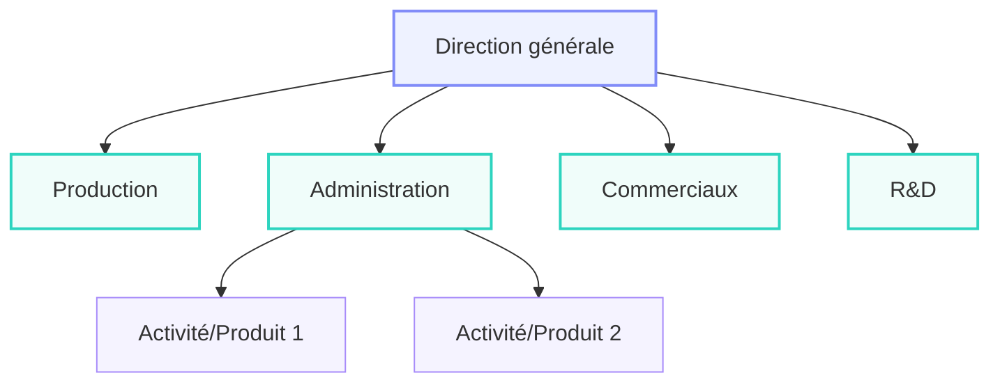
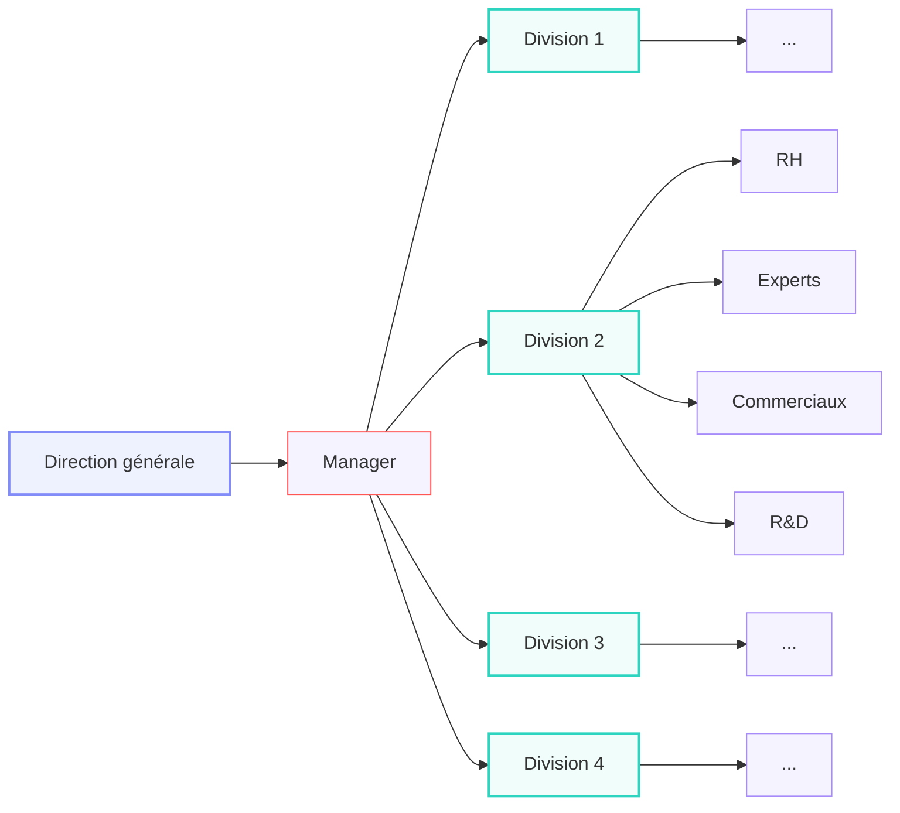

# Le développement de la grande entreprise et de sa gouvernance

## La division du travail au sein des entreprises

> [!définition] 
> La **gouvernance** d'une entreprise est l'ensemble des dispositions légales, réglementaires ou pratiques qui définissent le pouvoir et la gestion des responsabilités dans une entreprise.
> 
> Orienter l’entreprise signifie **prendre et contrôler** les décisions *stratégiques* qui ont un **effet déterminant** sur sa **pérennité** et donc sa **performance durable**.

### L'organisation scientifique du travail

Avec les SA, les entrepreneurs capitalistes sont désuets. Il y a maintenant une séparation entre la propriété et le contrôle des entreprises.

Les parties prenantes sont l'ensemble des acteurs qui participent au processus de l'entreprise de manière directe ou indirecte. Un salarié est une partie prenante. Un fournisseur également. Les consommateurs peuvent même être parties prenantes.

L'idée de l'organisation du travail arrive pendant une période très particulière, le **capitalisme managérial et la technostructure**. C'est une période durant laquelle le manager est ajouté au fonctionnement des entreprises. C'est l'évolution du contremaître.

Frederick Winslow Taylor, en 1911, propose l'OST (SOW) et le One Best Way (qui est la maximisation du profit).

Henry Ford applique la théorie de la production de Taylor aux Ford (dont la « Ford T »). Ce système fait passer le prix de la voiture de 800 $ à 300 $ (de 12 h à 2 h !).
Le fordisme donne peu de marge de manœuvre aux ouvriers. *C'est un peu des esclaves...*

Un autre mode de production (toujours dans les voitures), proposé au XXe siècle, est le **toyotisme** (par Toyota), basé sur la règle des **cinq zéros** :

1. 0 défaut (*pas de retours*)
2. 0 papiers (*bureaucratie/managérial*)
3. 0 arrêt (*pas d'arrêt de la chaîne de travail*)
4. 0 stock *(production directe, donc pas de coût d'entrepôt)*
5. 0 délais (*production en fonction de la demande*)

Pour y arriver, il faut respecter le Kaizen (l'amélioration continue) et le Kanban (suivi de la production).

### Les formes d'organisation de l'entreprise productive

Alfred Chandler, dans son livre La Main visible des managers (cf. la main invisible de Smith), montre que les managers font la coordination de la main invisible au sein des entreprises.

Le changement fondamental que les entreprises connaissent est celui de **leur structure interne**. Les entreprises étaient sous **forme de U** *pour unitaire* et deviennent des entreprises **M** *pour multidivisionnelles*.

#### Entreprises Unitaires

L'entreprise est divisée en départements. Chaque département est dirigé par des spécialistes, qui sont donc compétents, ensuite scindés par activité/produit. Mais les équipes sont interdépendantes. C'est extrêmement standardisé, et permet de faire des économies d'échelle.

Ce modèle fonctionne très bien pour Ford au début des années 1950.

**Cependant**, ce système est coûteux et instable si l'entreprise grandit trop. *Le temps décisionnel est important.* Il y a 3 autres problèmes :

1. Peu d'innovation à cause de l'isolation des marchés
2. L'évaluation des performances de chaque département est difficile
3. *Je l'ai pas*

#### Entreprises multidivisionnelles

Cette forme est beaucoup plus adaptée à l'innovation technologique, aux changements, perturbations et ruptures... Elle apparaît durant la seconde moitié du XIXe siècle.

Les départements sont remplacés par des **divisions** qui sont chacune des pôles de l'entreprise pour une activité/produit. Chaque équipe connaît son produit. Les managers ont maintenant des responsabilités.

Ce système est plus flexible :
- Un nouveau marché se crée ? On peut créer une nouvelle division !
- Les divisions sont motivées à être efficaces car mesurables et remplaçables/supprimables

## Le rôle de la hiérarchie

La hiérarchie est extrêmement importante car elle englobe aussi les coûts de transactions.

### L’arbitrage entre making et buying

Les entreprises essayent d'équilibrer acheter et créer pour toujours prendre le moins cher ?

D'après **Oliver Williamson**, rien que la recherche des informations coûte de l'argent. Trouver le « market failure », le bon plan, le produit pas cher à faire très cher à la vente.

Plus les **coûts de transaction** sont élevés, plus on le fait dans l'entreprise. Plus les **coûts d'organisation interne** sont élevés, moins on le fait et plus on l'achète.

Certains actifs sont plus chers à produire : dus à leur *géographie*, à *l'optimisation*... C'est aussi une source de coûts de transaction selon Williamson.

|                                  | **Marché**    | *Hybride*      | **Hiérarchie**    |
| -------------------------------- | ------------- | -------------- | ----------------- |
| Capacité d'adaptation autonome   | ++            | +              | 0                 |
| Capacité d'adaptation coordonnée | 0             | +              | ++                |
| Intensité de l'incitation       | ++            | +              | 0                 |
| Degré de contrôle administratif | 0             | +              | ++                |
| **Type de contrat**              | **Classique** | *Néoclassique* | **Subordination** |

### Les managers dans l’entreprise

Ces différentes approches préparent l'analyse *incontournable* de **Adolf Berle & Gardiner Means** sur les **managers**.

Ils font une enquête (*a survey*) et essayent de comprendre comment les entreprises qu'ils étudient ont une dispersion de la propriété ou non entre les actionnaires.

Paul Delorme (puis Jean Delorme), patron d'Air Liquide, possède 80 % des actions au XXe siècle. Il perd peu à peu le capital, jusqu'à finalement être expulsé de l'entreprise en 1953.

**On observe donc un passage de pouvoir du propriétaire familial au manager.**
