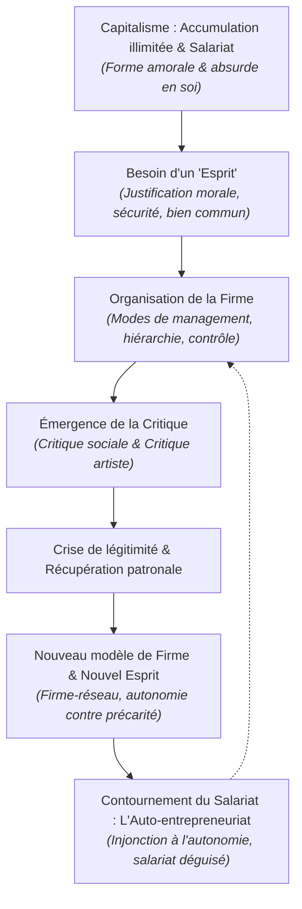
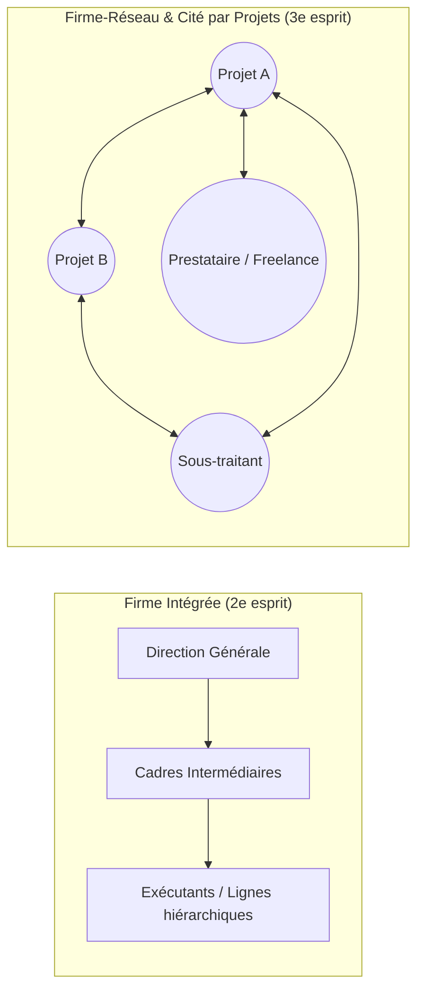

# Synthèse de lecture : Les Firmes et l'Esprit du Capitalisme

> **GIG ECONOMY** : économie des petits boulots 
> Dualisme du travail : les auto entrepreneurs sont mal payés, petits boulots, mauvais contrat, pas de sécu...
> Marché du travail à deux vitesses
> -> Capital humain perdu 

> **Documents sources analysés :**
> 1. **Françoise Piotet** sur Luc Boltanski et Ève Chiapello, *Le nouvel esprit du capitalisme* (Paris, Gallimard, 1999) — *L'Année sociologique*, 2001, vol. 51, n° 1, [[Sociologie générale - Fichier 2.pdf#page=2|p. 257-267]].
> 2. **Jean Clam** sur Niklas Luhmann, *Die Gesellschaft der Gesellschaft* [La société de la société] (Frankfurt, Suhrkamp, 1997) — *L'Année sociologique*, 2001, vol. 51, n° 1, [[Sociologie générale - Fichier 2.pdf#page=13|p. 268-273]].
> 3. **Sarah Abdelnour**, « Moi, petite entreprise. Impacts individuels et collectifs de la diffusion de l'auto-entrepreneuriat », *Regards croisés sur l'économie*, 2016/2, n° 19, [[Moi, Petite Entreprise - Fichier 3.pdf#page=1|p. 192-203]].

---

## Vue d'ensemble et Problématique

Le document explore les mutations contemporaines du capitalisme à travers le prisme de la sociologie générale, de la sociologie économique et de la sociologie du travail. Il confronte trois approches complémentaires :
- La sociologie de la critique et des cités de justification de **Luc Boltanski et Ève Chiapello**, recensée par **Françoise Piotet** ;
- La théorie des systèmes autopoïétiques acentrés de **Niklas Luhmann**, analysée par **Jean Clam** ;
- L'analyse empirique et critique de l'auto-entrepreneuriat par **Sarah Abdelnour**, démontrant la réalité contemporaine du contournement du salariat.

La problématique centrale s'articule autour d'un paradoxe : **comment les firmes et le système capitaliste parviennent-ils à susciter l'engagement des acteurs, à légitimer l'autorité managériale et à transformer leurs modes de contrôle, alors même que l'accumulation du capital est par essence amorale et porteuse de désordres sociaux ? Et comment la promesse d'autonomie individuelle aboutit-elle au démantèlement du statut protecteur du salariat ?**



> [!TIP] Lien avec le Texte 3 : Du démantèlement de la firme intégrée à la pulvérisation du salariat
> Alors que Boltanski et Chiapello s'arrêtaient à la mutation de la firme intégrée vers la firme-réseau des années 1990, Sarah Abdelnour ([[Moi, Petite Entreprise - Fichier 3.pdf#page=3|p. 193]]) étudie l'étape suivante : la pulvérisation même des frontières salariales de l'entreprise par la création institutionnelle du statut d'auto-entrepreneur (loi LME de 2008). L'autonomie promise par le « nouvel esprit » se concrétise ici sous la forme d'un transfert direct des risques d'entreprise vers les travailleurs individuels.

---

## 1. La Définition et la Dynamique du Capitalisme

Bien que la firme constitue le lieu d'application privilégié, sa compréhension requiert d'expliciter le cadre théorique du capitalisme formulé par Boltanski et Chiapello (B & C).

### A. Une définition minimale inspirée de Fernand Braudel

B & C distinguent expressément le **capitalisme** de l'**économie de marché** (la seconde servant uniquement à alimenter le premier) [[Sociologie générale - Fichier 2.pdf#page=3|p. 258]] :
1. **L'exigence d'accumulation illimitée du capital** par des moyens formellement pacifiques.
2. **Le salariat**, c'est-à-dire la subordination juridique et contractuelle du travail au capital.

> [!QUOTE] Citation clé
> « Le capitalisme mondial entendu comme la possibilité de faire fructifier son capital par l’investissement économique ou le placement économique connaît une expansion inégalée alors que, dans le même temps, la situation économique et sociale d’un grand nombre de personnes se dégrade » ([[Sociologie générale - Fichier 2.pdf#page=2|p. 257]]).

> [!TIP] Lien avec le Texte 3 : La fragilisation du critère définitoire du salariat
> La seconde condition fondamentale posée par B & C — **le salariat** ([[Sociologie générale - Fichier 2.pdf#page=3|p. 258]]) — est directement battue en brèche par les évolutions décrites par Sarah Abdelnour. Avec le régime de l'auto-entrepreneur, le capitalisme contemporain organise un **« contournement du salariat »** ([[Moi, Petite Entreprise - Fichier 3.pdf#page=6|p. 196]]). Les entreprises maintiennent le rapport d'extraction de valeur et de subordination économique sans passer par le contrat de travail salarié : c'est l'avènement du **« salariat déguisé »** ([[Moi, Petite Entreprise - Fichier 3.pdf#page=8|p. 198]]), où le travailleur indépendant ne dispose que d'un donneur d'ordre unique qui fixe les tarifs et les cadences.

### B. L'amoralisme intrinsèque et la métaphore de la colombe

En lui-même, le capitalisme est « une forme ordonnatrice de pratiques collectives parfaitement détachées de la sphère morale au sens où elle trouve sa qualité en elle-même » ([[Sociologie générale - Fichier 2.pdf#page=2|p. 257]]). Cette dynamique est fondamentalement **absurde** pour l'individu ordinaire : pourquoi subordonner sa vie à une course infinie à l'accumulation ?

Les auteurs convoquent la métaphore kantienne de la colombe [[Sociologie générale - Fichier 2.pdf#page=2|p. 257-258]] :
- La colombe, sentant la résistance de l'air, rêve d'un espace vide pour voler plus vite et plus haut.
- Or, dans le vide, l'oiseau s'écrase immédiatement car l'air est son seul support de sustentation.
- De même, **le capitalisme a besoin de la résistance morale et de la critique pour tenir et durer**. Laissé à son pur vide moral, il détruirait ses propres bases d'adhésion.

### C. Le rôle de l'« esprit du capitalisme » et des cités de justification

Pour que les individus s'engagent dans les organisations marchandes, le capitalisme doit emprunter à l'extérieur des idéologies justificatrices (Max Weber, Albert Hirschman, Louis Dumont). Cet esprit fournit trois garanties essentielles [[Sociologie générale - Fichier 2.pdf#page=4|p. 259]] :
1. **L'enthousiasme :** Des raisons stimulantes d'adhérer et de s'épanouir dans l'action.
2. **La sécurité :** Une garantie de protection pour soi et pour ses enfants.
3. **Le bien commun :** La preuve que l'enrichissement individuel sert l'intérêt collectif.

Cette articulation mobilise la théorie des **cités** (Boltanski et Thévenot, *De la justification*, 1991) : des métaphysiques politiques permettant d'arbitrer les grandeurs des êtres via des « épreuves de justice » reconnues légitimes [[Sociologie générale - Fichier 2.pdf#page=4|p. 259-260]].

### D. Le moteur du changement social : les deux critiques

L'histoire du capitalisme avance par une dialectique ternaire (thèse-antithèse-synthèse) sous la pression de deux grands pôles critiques [[Sociologie générale - Fichier 2.pdf#page=5|p. 260]] :
- **La critique sociale :** Dénonce l'exploitation, les inégalités, la misère et l'égoïsme des dominants.
- **La critique artiste :** Dénonce l'aliénation, l'inauthenticité, la standardisation, l'oppression et la perte d'autonomie.

Face à ces contestations, le capitalisme et ses firmes peuvent réagir de trois façons : la délégitimation, le contournement/déplacement (ex. délocalisations), ou **la récupération** du contenu de la critique pour refonder un nouveau modèle d'organisation [[Sociologie générale - Fichier 2.pdf#page=5|p. 260]].

> [!TIP] Lien avec le Texte 3 : L'« injonction à l'autonomie » comme récupération politique de la critique artiste
> La récupération patronale de la critique artiste analysée par B & C s'étend, selon Abdelnour, aux politiques publiques de l'emploi :
>
> > « S’opère alors un glissement sémantique et symbolique des politiques d’encouragement à la propriété vers des politiques d’injonction à l’autonomie, renforçant la rhétorique de responsabilisation des classes populaires : la propriété est moins le fruit d’un choix individuel qu’elle ne devient une nécessité économique et morale face à la "crise". » ([[Moi, Petite Entreprise - Fichier 3.pdf#page=5|p. 195]]).
> L'aspiration antibureaucratique à « être son propre patron » (versant artiste) est ainsi détournée pour neutraliser les garanties collectives du salariat (versant social).

---

## 2. Typologie Historique des Firmes : Les Trois Esprits du Capitalisme

À chaque grand cycle historique du capitalisme correspond une morphologie organisationnelle spécifique de la firme, une figure héroïque, un mode de coordination et des principes de justification [[Sociologie générale - Fichier 2.pdf#page=6|p. 261]].

| Dimension d'analyse | 1er Esprit (Fin XIXe siècle) | 2e Esprit (1930 - 1960/70) | 3e Esprit (Années 1990...) |
| :--- | :--- | :--- | :--- |
| **Structure de la firme** | Firme patronale et familiale, ateliers et premières manufactures | **Grande entreprise bureaucratique intégrée** (modèle fordiste/fayolien) | **Firme-réseau**, organisation par projets, entreprise « maigre » (*lean*) |
| **Figure centrale** | Le bourgeois entrepreneur (Sombart) | **Le directeur salarié et le « cadre »** | **L'entrepreneur de soi**, le travailleur nomade et autonome |
| **Mode de contrôle** | Domination personnalisée, autorité patriarcale | Hiérarchie formelle, règles bureaucratiques, **direction par objectifs (DPO)** | **Contrôle marchand**, évaluation permanente sur résultats et réputation |
| **Principes moraux** | Épargne, probité, accumulation patrimoniale | Compétence technique, dévouement à l'organisation, fidélité | **Flexibilité, employabilité, connectivité**, polyvalence |
| **Cités de référence** | Cité domestique & Cité marchande | **Cité industrielle** (efficacité) & **Cité civique** (progrès social) | **Cité par projets** (connexionnisme, réseau) |
| **Compromis salarial** | Statut social choisi, paternalisme patronal | **Sécurité de l'emploi**, carrières stables, État-providence | **Autonomie au travail contre précarisation** des statuts |

> [!TIP] Lien avec le Texte 3 : Prolongement de la typologie vers « l'auto-emploi » et les plateformes
> Le texte d'Abdelnour montre l'aboutissement contemporain de cette trajectoire :
> - **Morphologie :** La firme-réseau ne coordonne plus seulement des filiales ou des sous-traitants PME, mais met directement en réseau des micro-unités individuelles (« Moi, petite entreprise ») pilotées par des plateformes numériques comme Uber ([[Moi, Petite Entreprise - Fichier 3.pdf#page=11|p. 201]]).
> - **Figure :** « L'entrepreneur de soi », réservé aux cadres et consultants dans les années 1990, est étendu de force aux **classes populaires** (livreurs, chauffeurs, ouvriers du bâtiment) ([[Moi, Petite Entreprise - Fichier 3.pdf#page=5|p. 195]]).
> - **Compromis salarial :** Il n'y a plus de compromis salarial : l'illusion d'indépendance s'échange contre la perte pure et simple des droits sociaux (chômage, congés, retraite minimale) ([[Moi, Petite Entreprise - Fichier 3.pdf#page=11|p. 201-202]]).

---

## 3. Analyse Détaillée de l'Évolution des Firmes

### A. La firme managériale classique des années 1960 (2e esprit)

L'étude du corpus de littérature managériale des années 1960 révèle les fondements de la grande entreprise fordiste [[Sociologie générale - Fichier 2.pdf#page=8|p. 263]] :

- **La décentralisation méritocratique et la Direction par Objectifs (DPO) :** L'entreprise cherche à rompre avec le modèle de la bourgeoisie patrimoniale et les dérives du paternalisme (« cité domestique »). Le pouvoir au sein de la firme est confié à des directeurs salariés et à une élite de « cadres » dotés de compétences techniques et de rationalité scientifique (« cité industrielle »).
- **L'autonomie encadrée par la hiérarchie :** L'encadrement supérieur n'est plus une simple courroie de transmission technique. Il bénéficie d'une autonomie de gestion déléguée via le contrôle des résultats.
- **Le pacte fordiste et le progrès social :** L'entreprise s'institue en vecteur de démocratisation et de paix sociale. En contrepartie de la subordination des salariés à la division du travail, la grande firme garantit la **sécurité de l'emploi**, des plans de carrière prévisibles et des avantages sociaux en harmonie avec l'État-providence (« cité civique »).

```python
   ┌──────────────────────────────────────────────────────────────┐
   │            LA FIRME BUREAUCRATIQUE FORDISTE (1960)           │
   ├──────────────────────────────┬───────────────────────────────┤
   │ Cité Industrielle :          │ Cité Civique :                │
   │ • Planification rationnelle  │ • Compromis d'État-providence │
   │ • Compétence technique       │ • Sécurité de l'emploi        │
   │ • Hiérarchie méritocratique  │ • Carrières linéaires         │
   └──────────────────────────────┴───────────────────────────────┘
```

---

### B. Le tournant post-1968 : Récupération managériale et mutation de la firme

La transition vers la firme contemporaine trouve sa source dans les conflits du travail des années 1968-1975 [[Sociologie générale - Fichier 2.pdf#page=9|p. 264-265]] :

1. **La conjonction des critiques :** Les ouvriers et cadres dénoncent à la fois les cadences, l'autorité arbitraire, la parcellisation taylorienne (critique sociale) et l'ennui, l'abrutissement au travail, le manque d'authenticité et le refus de la hiérarchie (critique artiste).
2. **La stratégie patronale de troc organisationnel :** Le patronat réaménage les conditions de travail pour absorber la **critique artiste** :
   - Instauration des horaires variables, du travail en équipes semi-autonomes, des cercles de qualité, de l'enrichissement des tâches.
   - Suppression apparente des carcans hiérarchiques rigides.
3. **Le prix du compromis : la dérégulation sociale :**
   - En contrepartie de cette autonomie octroyée, la firme exige une **flexibilité accrue**, la modulation des temps de travail et la remise en cause des garanties collectives.
   - La **critique sociale est neutralisée et contournée**, ouvrant la voie à la sous-traitance, à la précarité et à l'individualisation des rémunérations [[Sociologie générale - Fichier 2.pdf#page=10|p. 265]].
4. **L'effritement des collectifs de travail :**
   - Politiques managériales de répression et d'évitement syndical.
   - Segmentation du marché du travail entre un noyau stable et une périphérie précarisée.
   - Brouillage des identités professionnelles et des repères de classes sociales (crise des classifications socioprofessionnelles / CSP) [[Sociologie générale - Fichier 2.pdf#page=10|p. 265-266]].

> [!TIP] Lien avec le Texte 3 : L'offensive idéologique contre le « grand salariat de 1945 »
> Ce processus de dérégulation post-1968 trouve son prolongement politique direct dans l'analyse de Sarah Abdelnour : les promoteurs du statut d'auto-entrepreneur affichent explicitement leur volonté d'en finir avec le pacte social de l'après-guerre. L'auteur du rapport préparatoire, François Hurel, dénonce ainsi « le modèle unique du grand salariat de 1945 » ([[Moi, Petite Entreprise - Fichier 3.pdf#page=6|p. 196]]), et les cercles ministériels libéraux conspuent « le choix collectif qui a été fait en faveur du salariat » ([[Moi, Petite Entreprise - Fichier 3.pdf#page=6|p. 196]]), cherchant à briser l'association historique entre grande firme, salariat stable et État-providence (Robert Salais, 1985 ; Robert Castel, 1999).

---

### C. La Firme-Réseau et la « Cité par Projets » (3e esprit)

À partir des années 1990, un nouveau modèle organisationnel s'impose dans le sillage de la mondialisation et des technologies de l'information [[Sociologie générale - Fichier 2.pdf#page=8|p. 263-264]] :

#### 1. Morphologie organisationnelle : la fin de la citadelle intégrée

- **Le culte de la « maigreur » (*lean organization*) :** La grande firme intégrée est démantelée au profit d'entités allégées, externalisant tout ce qui n'est pas son cœur de métier.
- **Le tissu du réseau et la dynamique des projets :** La firme se conçoit désormais comme un nœud temporaire dans un maillage réticulaire global :

  > [!QUOTE] Définition du projet dans la firme-réseau
  > « Sur le tissu sans couture du réseau, les projets dessinent une multitude de mini-espaces de calcul à l'intérieur desquels des ordres peuvent être engendrés et justifiés... [Le projet est] ce bout de réseau fortement activé... cette poche d'accumulation temporaire créatrice de valeurs » ([[Sociologie générale - Fichier 2.pdf#page=9|p. 264]]).

- **Substitution du marché à la hiérarchie :** Le commandement vertical et les contrôles formels s'effacent au profit d'une mise en concurrence interne et externe généralisée. Les équipes s'auto-organisent mais sont soumises à la pression directe du client et aux contraintes financières.



#### 2. La redéfinition des acteurs : « Grands » et « Petits »

Dans la cité par projets, la valeur et la légitimité des personnes sont réévaluées à l'aune de critères spécifiques [[Sociologie générale - Fichier 2.pdf#page=9|p. 264]] :

- **La figure du « Grand » :**
  - Il est **mobile, polyvalent, flexible, autonome, hyperactif et connecté**.
  - Sa formule d'investissement : il ne doit pas s'attacher aux structures fixes, ni à des biens matériels, ni même à une personnalité figée. Il doit être capable de passer instantanément d'un projet à un autre, générant continuellement du capital social.
  - Il maîtrise l'art de la négociation et incarne **« l'entrepreneur de soi »**.
- **La figure du « Petit » :**
  - Il est rigide, sédentaire, attaché à son métier, à son statut ou à son contrat.
  - Incapable de « faire réseau » ou de s'adapter au changement permanent, il devient un « poids mort », menacé de **désaffiliation**, d'exclusion et d'inemployabilité.

#### 3. L'effacement des frontières et le nouvel impératif de l'activité

- **Fusion de la vie privée et de la vie professionnelle :** L'individu est sommé d'investir sa subjectivité, son affect et son réseau relationnel dans son activité professionnelle. « L'homme devient le produit de son propre travail sur soi, la distinction entre vie privée et vie professionnelle s'efface et la besogne laisse la place à l'activité » [[Sociologie générale - Fichier 2.pdf#page=9|p. 264]].
- **Le dogme de l'employabilité :** La sécurité de l'emploi garantie par la firme d'autrefois est remplacée par le devoir individuel d'entretenir son « employabilité » — c'est-à-dire sa capacité marchande à trouver un nouveau projet [[Sociologie générale - Fichier 2.pdf#page=11|p. 266]].

> [!TIP] Lien avec le Texte 3 : De l'illusion du « Grand » à l'aliénation par l'autodiscipline
> Le concept d'« entrepreneur de soi » célébré dans la cité par projets trouve chez Sarah Abdelnour sa critique la plus décapante :
> - **L'autodiscipline sous contrainte :** Loin de l'autonomie épanouissante du cadre nomade, l'auto-entrepreneur subit une anxiété permanente liée à la recherche de revenus, des « horaires étendus » et une « perméabilité très forte des temps et espaces professionnels et domestiques » ([[Moi, Petite Entreprise - Fichier 3.pdf#page=11|p. 201]]).
> - **La perte de « l'affranchissement de l'hégémonie du travail » :** Abdelnour cite Robert Castel (1998) pour montrer le piège de cette condition :
>
> > « C’est [en effet] lorsque le travail est précaire, non protégé, entièrement livré au marché, que le travailleur est complètement immergé dans l’ordre du travail » ([[Moi, Petite Entreprise - Fichier 3.pdf#page=11|p. 201]]).
> - **Passage aux sociétés de contrôle :** Cette intériorisation de la contrainte matérialise le passage des « sociétés disciplinaires » (l'usine fordienne surveillée par le contremaître) aux « sociétés de contrôle et d'auto-contrôle » (Deleuze, Foucault), où le travailleur est assujetti à son propre contrôle intériorisé ([[Moi, Petite Entreprise - Fichier 3.pdf#page=11|p. 201]]).

---

## 4. Bilan Critique par Françoise Piotet : Les Failles du Modèle Managérial

Dans sa recension, la sociologue Françoise Piotet formule des réserves épistémologiques et empiriques majeures quant aux thèses de Boltanski et Chiapello [[Sociologie générale - Fichier 2.pdf#page=8|p. 263]], [[Sociologie générale - Fichier 2.pdf#page=10|p. 265]], [[Sociologie générale - Fichier 2.pdf#page=12|p. 267]] :

> [!WARNING] Les 4 objections sociologiques de Françoise Piotet
> 
> 1. **Confusion entre idéologie managériale et réalité des firmes :**
>    B & C s'appuient exclusivement sur la littérature de management prescriptive (des manuels normatifs rédigés pour des consultants et cadres). Ils prennent ces discours prescriptifs pour le reflet direct des pratiques réelles au sein des ateliers et bureaux.
> 
> 2. **Biais de sélection du corpus empirique :**
>    Le corpus textuel est hautement sélectif (ex. présence d'auteurs concordants, exclusion des voix patronales conservatrices ou contradictoires comme Pierre de Calan, omission des syndicats de cadres diversifiés).
> 
> 3. **Évacuation de la sociologie du travail et des contraintes matérielles :**
>    L'analyse privilégie une explication idéaliste (les idées et la critique mènent le monde). Elle néglige des variables déterminantes comme :
>    - La démographie et les pénuries structurelles de main-d'œuvre.
>    - Les mutations concrètes de l'appareil productif et des marchés mondiaux.
>    - Les rapports de force institutionnels et les dynamiques de négociation collective (J.-D. Reynaud).
> 
> 4. **L'angle mort de l'État :**
>    Alors que B & C conçoivent les cités comme des « métaphysiques politiques », ils ignorent le rôle structurant du cadre étatique et législatif dans la régulation des firmes et la constitution des marchés.

Piotet relève également un **paradoxe ultime** : pour moraliser et réguler cette cité par projets, B & C proposent une mosaïque de mesures (statut de l'activité, contrat d'activité, bilans de compétences, revenu universel) qui tendraient à **abolir le salariat**... alors même que le salariat figurait dans leur propre définition fondamentale du capitalisme ! [[Sociologie générale - Fichier 2.pdf#page=11|p. 266]].

> [!TIP] Lien avec le Texte 3 : Réponse empirique et confirmation éclatante des doutes de Françoise Piotet
> L'article de Sarah Abdelnour vient valider empiriquement sur le terrain les critiques de Piotet :
> 1. **L'État est au cœur de la déstabilisation :** Contrairement à l'angle mort de B & C relevé par Piotet ([[Sociologie générale - Fichier 2.pdf#page=12|p. 267]]), l'externalisation de la main-d'œuvre n'est pas qu'un phénomène spontané d'entreprise : elle a été construite et subventionnée par l'État à travers une loi explicite (Loi de modernisation de l'économie de 2008) et des dispositifs fiscaux sur mesure ([[Moi, Petite Entreprise - Fichier 3.pdf#page=4|p. 194]]). L'État employeur utilise même ce régime pour précariser ses propres agents publics ([[Moi, Petite Entreprise - Fichier 3.pdf#page=9|p. 199]]).
> 2. **Le paradoxe de la fin du salariat vérifié :** Le paradoxe souligné par Piotet (la tentation d'abolir le salariat) trouve sa confirmation négative : la sortie du salariat ne produit aucune libération, mais permet aux employeurs d'éviter le paiement des cotisations patronales, vidant les caisses de solidarité et atomisant les travailleurs face au marché ([[Moi, Petite Entreprise - Fichier 3.pdf#page=12|p. 202]]).

---

## 5. Prolongement Théorique : La Firme et l'Économie chez Niklas Luhmann

La seconde partie du recueil [[Sociologie générale - Fichier 2.pdf#page=13|p. 268-273]] présente la théorie des systèmes de Niklas Luhmann (*Die Gesellschaft der Gesellschaft*), analysée par **Jean Clam**. Elle apporte un contrepoint épistémologique saisissant à la sociologie de la justification de Boltanski et Chiapello :

- **L'économie comme sous-système autopoïétique clos :**
  Pour Luhmann, l'économie de la société moderne est un sous-système fonctionnellement différencié, fondé sur le médium de communication spécifique qu'est **l'argent** et le code binaire **paiement / non-paiement** [[Sociologie générale - Fichier 2.pdf#page=14|p. 269]].
- **L'autonomisation par le *self-interest* :**
  Le système économique s'est autonomisé via le concept d'intérêt individuel (*self-interest*), s'affranchissant de toute tutelle morale ou religieuse globale [[Sociologie générale - Fichier 2.pdf#page=17|p. 272]].
- **L'illusion du pilotage moral ou politique central :**
  Contrairement à B & C qui espèrent reconstruire une « convention de justice » pour encadrer le capitalisme, Luhmann affirme qu'il n'existe **aucun « supercode » moral** capable de chapeauter la société. La société moderne est « polycontexturale » : elle est acentrée et ne possède pas « d'adresse » à laquelle adresser des injonctions normatives [[Sociologie générale - Fichier 2.pdf#page=16|p. 271-272]].
- **Application aux organisations :**
  Les firmes ne changent pas par conversion morale à une cité de justice, mais par **leur propre « irritabilité » interne** face aux fluctuations de leur environnement (prix, lois, crises, communications concurrentes).

> [!TIP] Lien avec le Texte 3 : L'indexation directe sur le code Paiement / Non-paiement
> Le régime de l'auto-entrepreneur incarne l'élimination des amortisseurs sociaux pour soumettre directement l'individu au code binaire luhmannien **paiement / non-paiement** :
> - Dans le statut d'auto-entrepreneur, les cotisations sociales sont « strictement indexées sur le chiffre d'affaires » ([[Moi, Petite Entreprise - Fichier 3.pdf#page=4|p. 194]]) : pas de chiffre d'affaires = pas de cotisation = **pas de droits sociaux**.
> - Le salariat fordiste constituait précisément un découplage institutionnel entre le travailleur et les soubresauts immédiats du marché. L'auto-entrepreneuriat réaligne de manière autopoïétique le travail sur la communication monétaire pure, dénuée de toute convention morale collective.

---

## 6. Texte 3 : « Moi, petite entreprise » (Sarah Abdelnour, 2016) — L'Auto-entrepreneuriat ou le Contournement du Salariat

L'article de **Sarah Abdelnour**, publié en 2016 dans la revue *Regards croisés sur l'économie* ([[Moi, Petite Entreprise - Fichier 3.pdf#page=1|p. 192-203]]), apporte un éclairage sociologique et empirique crucial sur les transformations contemporaines du travail. Fondé sur une enquête de terrain combinant entretiens qualitatifs et données statistiques (exploitée plus largement dans Abdelnour, *Moi, petite entreprise. Les auto-entrepreneurs de l’utopie*, PUF, 2017), l'article analyse la mise en place et les usages du statut d'auto-entrepreneur en France depuis 2009.

La thèse centrale d'Abdelnour est que le régime de l'auto-entrepreneur constitue :
1. Un **dispositif politique délibéré de contournement du salariat**, porté par une idéologie néolibérale visant à déconstruire le modèle social français ;
2. Un **outil managérial de gestion ultra-flexible de la main-d'œuvre**, utilisé par les employeurs privés comme publics pour transférer les risques économiques sur les individus et échapper aux cotisations patronales ;
3. Un vecteur de **domination par l'autodiscipline et l'atomisation collective**, imposant une « injonction à l'autonomie » aux classes populaires et neutralisant les capacités de résistance syndicale.


---

### A. Genèse politique et cadre institutionnel : Du « tous propriétaires » au « tous entrepreneurs »

#### 1. Contexte historique : le retournement séculaire du travail indépendant

Pendant plus d'un siècle et demi, le modèle social français a été marqué par l'expansion continue du salariat. Or, depuis les années 1980, le travail indépendant connaît une résurgence numérique et symbolique (Arum et Müller, 2004), portée par le chômage structurel et l'expansion des formes particulières d'emploi qui participent d'un **« effritement du salariat »** (Castel, 1999) [[Moi, Petite Entreprise - Fichier 3.pdf#page=3|p. 193]].

Abdelnour met en lumière un glissement sociologique décisif dans les politiques d'emploi [[Moi, Petite Entreprise - Fichier 3.pdf#page=5|p. 195]] :
- **Fin des années 1970 :** Les incitations au travail indépendant visaient principalement les **cadres** au chômage pour les aider à créer des entreprises génératrices d'emplois.
- **Années 2000-2008 :** Les politiques d'encouragement à l'indépendance sont étendues à **l'ensemble du corps social**, et en premier lieu aux **classes populaires** et aux chômeurs de longue durée. 
- **Du propriétaire à l'entrepreneur :** En parallèle de la promotion d'une « France de tous propriétaires » (Abdelnour et Lambert, 2014), les gouvernements diffusent le mot d'ordre d'une France du **« tous entrepreneurs »** [[Moi, Petite Entreprise - Fichier 3.pdf#page=5|p. 195]].

> [!QUOTE] Sarah Abdelnour sur l'injonction à l'autonomie
> « S’opère alors un glissement sémantique et symbolique des politiques d’encouragement à la propriété vers des politiques d’injonction à l’autonomie, renforçant la rhétorique de responsabilisation des classes populaires : la propriété est moins le fruit d’un choix individuel qu’elle ne devient une nécessité économique et morale face à la "crise". » ([[Moi, Petite Entreprise - Fichier 3.pdf#page=5|p. 195]]).

#### 2. Le cadre juridique et fiscal de la loi LME de 2008

Institué par la loi de modernisation de l'économie (LME) du 4 août 2008 et entré en vigueur au 1er janvier 2009, le régime de l'auto-entrepreneur est pensé comme un **« permis d'entreprendre »** universel, pour des activités réduites et sans engagement financier préalable [[Moi, Petite Entreprise - Fichier 3.pdf#page=4|p. 194]] :

- **Régime fiscal et de gestion simplifié :**
  - Seuils de chiffre d'affaires annuels (dans sa version initiale : 80 000 € pour la vente, 32 000 € pour les services et professions libérales).
  - Franchise de TVA, d'impôt sur les sociétés et de taxe professionnelle.
  - Absence d'immatriculation obligatoire initiale : une simple déclaration en ligne suffit, entraînant la dispense de frais d'inscription et du stage préalable de préparation à l'installation pour les artisans.
  - Option pour le prélèvement libératoire de l'impôt sur le revenu (taux de 1 % à 2,2 %).
- **Régime social dérogatoire :**
  - **Cotisations sociales strictement indexées sur le chiffre d'affaires** (12 % pour la vente, 18,3 % pour les professions libérales, 21,3 % pour les services).
  - **Suppression du forfait incompressible de cotisations** qui protégeait historiquement l'accès aux droits sociaux minimums pour tout travailleur indépendant.
- **Pérennité politique et ajustements :** Malgré des retours partiels à la régulation (ré-immatriculation forcée des artisans face à la fronde des chambres de métiers, durcissement des conditions d'accès à la couverture maladie et retraite), le dispositif a résisté à toutes les alternances gouvernementales [[Moi, Petite Entreprise - Fichier 3.pdf#page=4|p. 194]].

---

### B. Une attaque politique délibérée contre la « société salariale »

L'enquête d'Abdelnour démontre que le régime n'est pas un simple ajustement technique, mais l'instrument d'une **bataille idéologique contre l'État social**.

#### 1. La remise en cause du compromis fordiste d'après-guerre

Les promoteurs du dispositif mènent une croisade ouverte contre le salariat organisé :
- **François Hurel**, auteur du rapport préalable à la loi, fustige ce qu'il nomme avec mépris **« le modèle unique du grand salariat de 1945 »** [[Moi, Petite Entreprise - Fichier 3.pdf#page=6|p. 196]].
- Les conseillers du secrétaire d'État **Hervé Novelli** dénoncent **« le choix collectif qui a été fait en faveur du salariat »** [[Moi, Petite Entreprise - Fichier 3.pdf#page=6|p. 196]].

> [!QUOTE] François Hurel (entretien juillet 2009)
> « On nous a fait croire pendant trente ans, quarante ans, que [...] les grandes villes allaient mieux épanouir tout le monde en France, que la grande entreprise allait mieux employer tout le monde, que le grand hôpital allait mieux soigner tout le monde, que la grande université allait mieux former tout le monde, bref que tout ce qui était grand était bien. » ([[Moi, Petite Entreprise - Fichier 3.pdf#page=7|p. 197]]).

Ce discours vise directement la grande firme fordiste, analysée par la théorie de la régulation (Robert Boyer, 2004) et Robert Salais (1985) comme le **« lieu par excellence du rapport salarial moderne »** [[Moi, Petite Entreprise - Fichier 3.pdf#page=7|p. 197]].

#### 2. Le procès de l'État-providence et la rhétorique inversée du privilège

L'offensive menée par le groupe politique des « réformateurs » de Novelli repose sur la conviction que « les politiques publiques mises en œuvre au nom de l'État-providence ont conduit notre pays au bord de la ruine » [[Moi, Petite Entreprise - Fichier 3.pdf#page=7|p. 197]].

Pour légitimer cette dérégulation, les promoteurs opèrent un retournement rhétorique :
- Le salariat statutaire et protégé est disqualifié comme un bastion réservé à une caste d'« insiders » privilégiés.
- L'auto-entrepreneuriat se pare ainsi de vertus de justice sociale et se présente comme un moyen **« d'absorber la misère du monde »** (selon l'expression de F. Hurel) [[Moi, Petite Entreprise - Fichier 3.pdf#page=8|p. 198]]. La déprotection du travail est présentée comme une œuvre d'émancipation pour les chômeurs et les exclus.

---

### C. Les Usages Employeurs : Externalisation, Salariat Déguisé et Dépendance Économique

Comme le rappelle Abdelnour, une loi ne prend sa consistance réelle que par ses usages. À l'opposé de la fable managériale louant la soif d'entreprendre des Français, l'enquête sociologique révèle que **les employeurs sont les premiers instigateurs et bénéficiaires du statut** [[Moi, Petite Entreprise - Fichier 3.pdf#page=8|p. 198]].

#### 1. L'ampleur du salariat déguisé

Dans un grand nombre de cas, les auto-entrepreneurs ne se mettent pas à leur compte par choix, mais par obligation imposée par leur employeur pour obtenir une mission ou conserver leur activité :
- **Critères du salariat déguisé :** Le travailleur n'a qu'un unique client, qui lui impose le choix du statut d'auto-entrepreneur, fournit le matériel et le local de travail, dicte les horaires et fixe unilatéralement la rémunération [[Moi, Petite Entreprise - Fichier 3.pdf#page=8|p. 198]].
- **Données statistiques :** Dans les secteurs des services aux entreprises (conseil, ingénierie) et de l'information/communication, **près de 60 % des auto-entrepreneurs n'ont qu'un ou deux clients** (Barruel et al., 2012) [[Moi, Petite Entreprise - Fichier 3.pdf#page=8|p. 198]].
- **Données qualitatives de terrain :** Lors de son enquête sociologique, Sarah Abdelnour constate que la situation de subordination économique et de salariat déguisé concerne **environ la moitié des personnes interrogées** [[Moi, Petite Entreprise - Fichier 3.pdf#page=9|p. 199]].

#### 2. La rentabilité du contournement pour les employeurs privés et publics

Le gain organisationnel et financier pour les donneurs d'ordres est considérable [[Moi, Petite Entreprise - Fichier 3.pdf#page=9|p. 199]] :
- **Secteur privé et capitalisme de plateforme :** Le statut permet aux firmes d'utiliser une main-d'œuvre ultra-flexible, de purger les coûts administratifs et de gestion des ressources humaines, d'éviter toute indemnité de rupture et, par-dessus tout, **d'éliminer le paiement des cotisations patronales**. Des entreprises comme **Uber** et les plateformes de VTC ont bâti l'intégralité de leur modèle économique sur cette masse de chauffeurs indépendants payés à la course sans la moindre protection salariale.
- **Secteur public :** L'État et les administrations publiques sont eux-mêmes de grands utilisateurs de ce contournement. Face au gel des embauches statutaires et aux restrictions budgétaires, les hôpitaux, universités et collectivités locales recourent aux auto-entrepreneurs pour remplacer des vacations ou des contrats à durée déterminée (CDD), ou pour maintenir au travail des retraités précaires [[Moi, Petite Entreprise - Fichier 3.pdf#page=9|p. 199]].

---

### D. Déconstruction du Modèle Social et Gouvernementalité Néolibérale

La dynamique de l'auto-entrepreneuriat s'inscrit au cœur de la gouvernementalité néolibérale (Denord, 2007) : l'État organise son propre retrait pour substituer les mécanismes de concurrence marchande aux solidarités instituées [[Moi, Petite Entreprise - Fichier 3.pdf#page=9|p. 199]].

#### 1. L'injonction foucaldienne à devenir une « entreprise permanente »

Abdelnour mobilise les cours de **Michel Foucault** au Collège de France (*Naissance de la biopolitique*, 1978-1979) pour décrypter cette transformation anthropologique du travailleur :

> [!QUOTE] Michel Foucault cité par Sarah Abdelnour
> « Il faut que la vie même de l’individu – avec par exemple son rapport à sa propriété privée, son rapport à sa famille, à son ménage, son rapport à ses assurances, son rapport à sa retraite – fasse de lui comme une sorte d’entreprise permanente et d’entreprise multiple. » (Foucault, 2004, p. 149 ; cité p. 199-200).

L'auto-entrepreneur est sommé de gérer son existence, ses compétences et sa santé comme un capital productif personnel dont il est l'unique responsable comptable.

#### 2. La solitude numérique et le piège du « clic »

Le statut a été pensé comme un symbole du recul des guichets publics physiques par une **dématérialisation totale** : « créer sa boîte en trois clics sur Internet » [[Moi, Petite Entreprise - Fichier 3.pdf#page=10|p. 200]]. 
L'enquête met en lumière les conséquences concrètes de cet abandon institutionnel :
- Les travailleurs réalisent leur démarche seuls chez eux, sans conseil syndical ni orientation administrative.
- Les enquêtés découvrent rapidement les pièges de cette facilité apparente : erreurs d'options fiscales pénalisantes, incompréhension des prélèvements sociaux, opacité du partage des tâches entre organismes (RSI, Urssaf, Trésor public) et angoisse face aux rappels de cotisations [[Moi, Petite Entreprise - Fichier 3.pdf#page=10|p. 200]].

#### 3. Autodiscipline et perte de l'affranchissement du travail

L'argument de vente de l'indépendance repose sur la conquête d'une prétendue autonomie. Or, l'observation empirique révèle une aliénation renouvelée [[Moi, Petite Entreprise - Fichier 3.pdf#page=11|p. 201]] :
- **L'anxiété du revenu :** Privé d'assurance chômage et de salaire minimum garanti, l'auto-entrepreneur vit dans la hantise permanente du mois suivant.
- **L'autodiscipline totale :** Les horaires de travail explosent, le travail envahit le domicile et la vie familiale sans trêve possible. Le travailleur devient son propre contremaître et son propre censeur : on assiste au basculement décrit par Foucault et Gilles Deleuze des **sociétés disciplinaires** (la surveillance extérieure du patronat) vers les **sociétés de contrôle et d'auto-contrôle** [[Moi, Petite Entreprise - Fichier 3.pdf#page=11|p. 201]].
- **La thèse de Robert Castel sur l'ordre du travail :** Le statut supprime l'un des acquis civilisationnels majeurs du salariat : **l'affranchissement de l'hégémonie du travail** (Castel, 1998). C'est précisément parce qu'il n'est plus protégé par le salariat que le travailleur se retrouve intégralement possédé et submergé par le travail marchant pour survivre [[Moi, Petite Entreprise - Fichier 3.pdf#page=11|p. 201]].

---

### E. Impacts Collectifs : Atomisation Sociale et Ruine de la Solidarité

Au niveau macro-sociologique, la généralisation de l'auto-entrepreneuriat produit une profonde désarticulation des forces sociales [[Moi, Petite Entreprise - Fichier 3.pdf#page=12|p. 202]] :

1. **La résignation et la libéralisation des consciences :** Les individus, découragés par l'absence d'emplois salariés stables et correctement rémunérés à leur niveau de qualification, finissent par intégrer l'idée qu'ils ne doivent « plus rien attendre du salariat ni de la collectivité » [[Moi, Petite Entreprise - Fichier 3.pdf#page=12|p. 202]].
2. **La triple neutralisation de la revendication salariale :**
   - **Moins nécessaire :** L'individu internalise l'idéologie de la « débrouille individuelle » pour boucler ses fins de mois.
   - **Peu légitime :** Le dogme libéral sous-entend que si l'on échoue, on n'a qu'à s'en prendre à soi-même puisque « tout le monde peut entreprendre ».
   - **Matériellement impossible :** Situés hors du droit du travail, privés de délégués du personnel, de comités d'entreprise et d'ancrage dans les syndicats, les auto-entrepreneurs sont dans l'incapacité structurelle d'engager un rapport de force collectif [[Moi, Petite Entreprise - Fichier 3.pdf#page=12|p. 202]].
3. **L'assèchement des caisses de Sécurité sociale :** En substituant des prestations facturées à des salaires soumis aux cotisations patronales, les firmes privent la Sécurité sociale, les caisses de retraite et l'assurance chômage de ressources substantielles, enclenchant un cercle vicieux de sous-financement qui sert ensuite de prétexte à de nouveaux reculs de l'État social [[Moi, Petite Entreprise - Fichier 3.pdf#page=12|p. 202]].

---

## 7. Tableau Comparatif Général et Articulation des Textes

Le tableau ci-dessous récapitule les positions respectives des trois corpus sur la nature de la firme, le rôle de l'État et la dynamique du salariat.

| Dimension d'analyse | Boltanski & Chiapello (1999) *(Texte 1)* | Françoise Piotet (2001) *(Texte 1bis - Critique)* | Niklas Luhmann (1997) *(Texte 2)* | Sarah Abdelnour (2016) *(Texte 3)* |
| :--- | :--- | :--- | :--- | :--- |
| **Objet central** | Les idéologies managériales et la justification morale du capitalisme. | Les pratiques réelles de travail et les relations professionnelles. | La société moderne comme système fonctionnellement différencié. | Le statut d'auto-entrepreneur et le contournement du salariat. |
| **Statut du Salariat** | Pilier constitutif du capitalisme mais source d'aliénation fordiste. | Cadre institutionnel conquis par les luttes et la négociation collective. | Simple vecteur d'inclusion par le sous-système économique. | Cible d'une déconstruction politique ; modèle de protection sociale détruit. |
| **Rôle de l'État** | Quasi absent de l'analyse (relégué aux métaphysiques politiques des cités). | **Angle mort majeur** : l'État structure le marché et le droit du travail. | Système politique différencié, incapable de piloter l'économie. | **Acteur central** : l'État néolibéral légifère (LME 2008) pour précariser et emploie lui-même. |
| **Moteur du Changement** | Dialectique morale : tension entre la critique et l'esprit d'accumulation. | Contraintes matérielles, démographie, technologies et rapports de force. | Autopoïèse interne et « irritabilité » du système aux signaux de l'environnement. | Volonté politique de classe, dérégulation patronale et mise au travail néolibérale. |
| **Vision de l'« Autonomie »** | Revendication artiste récupérée par la firme en flexibilité et projets. | Mascarade prescriptive éloignée des réalités des ateliers. | Non-pertinente sociologiquement (seule compte la communication). | **Injonction politique aliénante** conduisant à l'autodiscipline et au salariat déguisé. |

---

## Synthèse Opérationnelle pour Révision

| Notions Clés | Auteurs de Référence | Définitions & Mécanismes Organisationnels |
| :--- | :--- | :--- |
| **Capitalisme (minimal)** | Boltanski & Chiapello (1999) | Accumulation pacifique illimitée du capital + subordination salariale ([[Sociologie générale - Fichier 2.pdf#page=3|p. 258]]). |
| **Esprit du capitalisme** | B & C (1999), Max Weber | Idéologie fournissant enthousiasme, sécurité et bien commun pour légitimer l'accumulation ([[Sociologie générale - Fichier 2.pdf#page=4|p. 259]]). |
| **Cité par projets** | Boltanski & Chiapello (1999) | Convention de justice connexionniste valorisant la flexibilité, la mobilité et l'employabilité ([[Sociologie générale - Fichier 2.pdf#page=9|p. 264]]). |
| **Biais managérialiste** | Françoise Piotet (2001) | Erreur méthodologique consistant à prendre le discours prescriptif des manuels de gestion pour la réalité du travail ([[Sociologie générale - Fichier 2.pdf#page=12|p. 267]]). |
| **Autopoïèse & Code binaire** | Niklas Luhmann (1997) | Clôture opérationnelle du système économique codé en **paiement / non-paiement**, insensible aux injonctions morales ([[Sociologie générale - Fichier 2.pdf#page=14|p. 269]]). |
| **Contournement du salariat** | Sarah Abdelnour (2016) | Stratégie patronale et politique consistant à remplacer l'emploi salarié par des prestations indépendantes ([[Moi, Petite Entreprise - Fichier 3.pdf#page=6|p. 196]]). |
| **Salariat déguisé** | Sarah Abdelnour (2016) | Fausse indépendance où le travailleur subit une subordination économique totale auprès d'un unique donneur d'ordre ([[Moi, Petite Entreprise - Fichier 3.pdf#page=8|p. 198]]). |
| **Injonction à l'autonomie** | Sarah Abdelnour (2016) | Idéologie contraignant les classes populaires à l'auto-emploi sous prétexte d'émancipation personnelle face au chômage ([[Moi, Petite Entreprise - Fichier 3.pdf#page=5|p. 195]]). |
| **Entreprise de soi permanente** | Michel Foucault (2004), S. Abdelnour | Subjectivité néolibérale où l'individu doit gérer sa vie entière et ses sécurités comme un capital marchand ([[Moi, Petite Entreprise - Fichier 3.pdf#page=10|p. 200]]). |
| **Hégémonie du travail** | Robert Castel (1998), S. Abdelnour | Aliénation du travailleur précaire qui, privé de garanties collectives, se retrouve intégralement possédé par la quête de subsistance ([[Moi, Petite Entreprise - Fichier 3.pdf#page=11|p. 201]]). |
| **Évitement des cotisations** | Sarah Abdelnour (2016) | Économie de charges patronales qui vide les caisses de Sécurité sociale et désolidarise les travailleurs ([[Moi, Petite Entreprise - Fichier 3.pdf#page=12|p. 202]]). |
