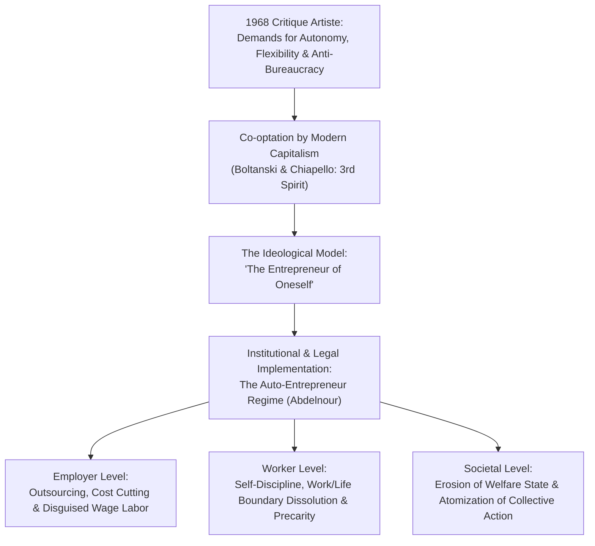

# Synthesis: The Metamorphosis of Work, Autonomy, and Contemporary Capitalism

**A Sociological Synthesis of:**
1. **Sarah Abdelnour (2016)**, *"Moi, petite entreprise. Impacts individuels et collectifs de la diffusion de l'auto-entrepreneuriat"*, *Regards croisés sur l'économie*, n° 19.
2. **Françoise Piotet (2001)**, Review of Luc Boltanski & Ève Chiapello, *Le nouvel esprit du capitalisme* (1999) & **Jean Clam (2001)**, Review of Niklas Luhmann, *Die Gesellschaft der Gesellschaft* (1997), *L'Année sociologique*, vol. 51, n° 1.

---

## 1. Executive Summary

Both documents examine how modern capitalism reorganizes labor, dismantles post-WWII collective protections, and mobilizes workers through the promise of individual freedom. 

- **Boltanski & Chiapello (reviewed by Piotet)** offer a macro-sociological theory showing how capitalism absorbed the post-1968 demands for freedom and autonomy (*critique artiste*), neutralizing traditional class struggle (*critique sociale*). This shift gave birth to the **"Third Spirit of Capitalism"**—a network-based, project-driven order centered on the ideological figure of the **"entrepreneur of oneself" (*entrepreneur de soi*)**.
- **Sarah Abdelnour** provides an empirical investigation demonstrating how this ideological imperative was institutionalized into French public policy through the 2008/2009 creation of the **"auto-entrepreneur" (self-employed/micro-enterprise)** regime. She reveals how the regime acts as a tool to bypass wage labor (*contournement du salariat*), shifts business risks onto individuals, and replaces collective bargaining with internalized self-discipline (*autodiscipline*).
- **Luhmann (reviewed by Clam)** reinforces this picture through systems theory, highlighting how modern functionally differentiated societies display intense structural interdependency while simultaneously producing deep structural exclusion (*sociétés fortement excluantes*).

Together, the texts demonstrate that what is celebrated as personal emancipation and flexibility frequently functions as a new mechanism of domination and precariousness.

---

## 2. Key Shared Concepts and Vocabulary

| Concept / Keyword                                                                                    | In Abdelnour (*Moi, petite entreprise*)                                                                          | In Boltanski & Chiapello (*Le nouvel esprit du capitalisme*)                                                         | Synthetic Definition & Sociological Meaning                                                                                |
| :--------------------------------------------------------------------------------------------------- | :--------------------------------------------------------------------------------------------------------------- | :------------------------------------------------------------------------------------------------------------------- | :------------------------------------------------------------------------------------------------------------------------- |
| **Entrepreneur of Oneself**  *(L'entrepreneur de soi / Moi, petite entreprise)*                   | Micro-entrepreneurs legally defining themselves as individual businesses ("Moi, petite entreprise").             | Central figure of the 3rd spirit: an individual who treats life and career as an ongoing capital project.            | The internal transformation of the worker from a subordinate employee into a self-managing, risk-bearing business entity.  |
| **Injunction to Autonomy**  *(Injonction à l'autonomie / Critique artiste)*                       | Political mandate urging the working class to take charge of their own employment and destiny.                   | Co-optation of the 1968 demand for liberation from hierarchy, bureaucratic rigidity, and alienation.                 | Autonomy converted from an emancipatory right into an obligatory duty, making failure an individual moral flaw.            |
| **Bypassing Wage Labor**  *(Contournement du salariat / Déconstruction)*                          | Deliberate strategy by employers and the state to replace employment contracts with commercial contracts.        | Fragmentation of the Fordist compromise; shift to project-based contracting, outsourcing, and lean firms.            | The structural dismantling of the post-WWII wage-earning society (*société salariale*) and its associated social security. |
| **Disguised Wage Labor**  *(Salariat déguisé / Métamorphoses de la subordination)*                | Auto-entrepreneurs economically dependent on a single client who dictates tasks, schedules, and pay.             | New forms of subordination masked behind project autonomy, horizontal teamwork, and client-vendor relationships.     | Formal commercial independence masking effective economic, algorithmic, or organizational subordination.                   |
| **Self-Discipline & Control**  *(Autodiscipline / Sociétés de contrôle)*                          | Workers internalizing market pressures, working excessive hours, and disciplining themselves (Deleuze/Foucault). | Workers becoming "the product of their own work on themselves"; disappearance of work/life boundaries.               | The shift from direct supervisory oversight to internalized psychological and economic discipline.                         |
| **Atomization & De-unionization**  *(Sape des structures collectives / Affaiblissement syndical)* | Isolation of remote, solo workers ("en trois clics"), rendering collective claims illegitimate or impossible.    | Erosion of collective class identity (*"communauté de destin"*); crisis of traditional union frameworks.             | The breakdown of collective solidarity and institutional power balances in favor of isolated individual negotiation.       |
| **Inclusion / Exclusion**  *(Désaffiliation / Sociétés excluantes)*                               | Trapping vulnerable workers in precarious solo work without unemployment insurance (Castel).                     | The distinction between the connected "Grand" (employable) and the isolated, rigid "Petit" (*désaffilié* / Luhmann). | Mechanisms where access to activity creates high vulnerability and excludes workers from fundamental social safety nets.   |

---

## 3. Main Insights and Common Themes Connecting the Texts

### Theme 1: The Co-optation of Autonomy—From Emancipation to Obligation
- **The Theoretical Shift**: Boltanski & Chiapello explain that capitalism overcame its post-1968 legitimacy crisis by assimilating the *critique artiste*. Salaried employees hated authoritarian bosses, monotonous conveyor belts, and bureaucratic life; management responded by offering autonomy, project-based initiatives, and flat networks.
- **The Empirical Reality**: Abdelnour shows that this promise of autonomy was converted into a coercive policy tool (*injonction à l'autonomie*). For working-class individuals and job seekers, setting up an auto-enterprise is not a luxury choice for self-actualization, but an economic survival mechanism in the face of structural unemployment. Autonomy ceases to be freedom; it becomes a mandate to manage one's own precariousness.

### Theme 2: The Deliberate Dismantling of the Fordist Wage-Earner Compromise
- **The Fordist Golden Age (2nd Spirit)**: In both texts, the post-1945 era is recognized as one where labor protections were anchored in the large industrial firm, collective bargaining, and the expansion of the Welfare State (*État-providence*).
- **The Neoliberal Counter-Offensive**: Abdelnour documents how promoters of the auto-entrepreneur regime (like François Hurel and Hervé Novelli) explicitly targeted "the single model of the large wage-earning society of 1945." Piotet similarly observes the retreat of the state and the fragmentation of standardized employment protections (*"métamorphoses de la subordination"*). Both texts identify a common agenda: unbundling employment security to make the workforce hyper-flexible and cheap.

### Theme 3: Total Immersion in Work and the Dissolution of Life Boundaries
- **Work Overflows Life**: In the *cité par projets* (Boltanski & Chiapello), the distinction between private life and professional life completely dissolves (*"la distinction entre vie privée et vie professionnelle s'efface"*). Because the individual is judged on their network presence and adaptability, they must constantly cultivate their "employability."
- **The Self as an Exploited Resource**: Abdelnour identifies this identical pattern among micro-entrepreneurs. Lacking steady salaries and unemployment insurance, workers cannot disconnect. They live in constant anxiety over future contracts, working extreme, irregular hours at home. Quoting Robert Castel, Abdelnour highlights that far from liberating the worker, deregulation immerses them entirely into the order of labor: when labor lacks institutional boundaries, work conquers every dimension of existence.

### Theme 4: The Sapping of Collective Action and Class Consciousness
- **Weakening of Counter-Powers**: Piotet notes that trade unions were disoriented by the 3rd spirit of capitalism, which framed collective representation as rigid and obsolete, fracturing the sense of a shared collective destiny (*"communauté de destin"*).
- **The Ideology of Individual Hustle**: Abdelnour demonstrates the end state of this process: micro-entrepreneurs operate completely alone, registering online "in three clicks." Because they are categorized as "entrepreneurs" rather than workers, they are cut off from labor law, workplace representation, and strike actions. Grievances against the employer/client are neutralized: if a worker fails to make a living, the ideology dictates that they simply did not work hard enough.

### Theme 5: Modern Integration Coupled with Structural Exclusion
- **Luhmann's Paradox**: Jean Clam's review of Luhmann establishes that modern functionally differentiated systems are intensely integrated yet produce deep structural exclusion (*"sociétés fortement excluantes"*).
- **Abdelnour's Illustration**: Auto-entrepreneurs are formally included in the economy (they have a SIRET number and declare revenue), yet substantively excluded from the benefits of the social model (no paid leave, no sick pay protection comparable to wage earners, no unemployment compensation, and negligible pension accumulation). They are precarious insiders who bear all the risks of market volatility.

---

## 4. Specific Supporting Quotes and Citations

The table below contrasts and pairs verbatim passages from both texts across the central sociological axes:

| Sociological Axis | Sarah Abdelnour (*Moi, petite entreprise*) | Boltanski & Chiapello / Luhmann (*Sociologie générale*) |
| :--- | :--- | :--- |
| **1. The Model of the "Self as Enterprise"** | *"Selon l’intuition foucaldienne, en régime néolibéral, « il faut que la vie même de l’individu [...] fasse de lui comme une sorte d’entreprise permanente et d’entreprise multiple » (Foucault, 2004 : 149)."* (p. 199-200) | *"Connexioniste. Entrepreneur de soi."* (Table of the 3rd Spirit, p. 261)  *"Dans la cité par projets, l’homme devient le produit de son propre travail sur soi, la distinction entre vie privée et vie professionnelle s’efface et la besogne laisse la place à l’activité."* (p. 264) |
| **2. Dismantling the 1945 Social & Fordist Model** | *"L’auteur du rapport préalable à la loi, François Hurel, regrette « le modèle unique du grand salariat de 1945 », tandis qu’un conseiller du secrétaire d’État Hervé Novelli [...] conspue « le choix collectif qui a été fait en faveur du salariat »."* (p. 197)  *"C’est donc à tout un modèle social, associé à la planification de l’après-guerre, que s’oppose le régime de l’auto-entrepreneur."* (p. 197) | *"Aux années 1960 correspond la direction par objectifs [...] L’entreprise se voit confier un rôle central dans le progrès social et le management sert la démocratie, l’État-providence complétant harmonieusement ce dispositif."* (p. 263-264)  *"Cette « déconstruction du monde du travail » qui va s’opérer à partir du milieu des années 1970..."* (p. 265) |
| **3. Disguised Subordination & Risk Externalization** | *"Ces situations peuvent être qualifiées de salariat déguisé, dans la mesure où les auto-entrepreneurs n’ont qu’un « client », qui a imposé le choix du statut, fournit le matériel et/ou le lieu de travail, définit les missions et fixe la rémunération."* (p. 198)  *"L’employeur devenu client peut gérer la main-d’œuvre de manière extrêmement flexible [...] et éviter le paiement des cotisations patronales."* (p. 199) | *"Le patronat va intégrer [...] la demande de plus d’autonomie exprimée par les salariés, mais ceci se fera en échange d’une flexibilité accrue et d’une précarisation croissante qui pourront se développer impunément..."* (p. 264-265)  *"...ce que A. Supiot nomme les métamorphoses de la subordination..."* (p. 265) |
| **4. Inescapable Work & Self-Discipline** | *"L’enquête plus précise sur leurs pratiques de travail met au jour l’emprise de l’indépendance : horaires étendus, perméabilité très forte des temps et espaces professionnels et domestiques, et très forte autodiscipline au travail."* (p. 201)  *"« C’est lorsque le travail est précaire, non protégé, entièrement livré au marché, que le travailleur est complètement immergé dans l’ordre du travail » (Castel, 1998)."* (p. 201) | *"Le grand est celui qui est flexible, polyvalent, actif et autonome donc employable [...] A contrario, le petit est caractérisé par une incapacité à s’engager, à communiquer, par sa rigidité. Le petit n’est pas connecté au réseau, il est désaffilié."* (p. 264) |
| **5. Atomization and the Demise of Collective Action** | *"La revendication salariale devient à la fois moins nécessaire (on se débrouille seul), peu légitime (chacun peut s’en sortir) et impossible matériellement (aux marges du droit du travail et des collectifs organisés)."* (p. 202)  *"Le modèle social est donc attaqué tant par l’évitement des cotisations patronales [...] que par l’atomisation des travailleurs et une idéologie de la débrouille individuelle."* (p. 202) | *"L’affaiblissement du syndicalisme tient à la fois à des politiques patronales répressives et de contournement [...] afin de « supprimer les lieux où les adhérents auraient pu construire une unité d’action sur le partage d’une communauté de destin »."* (p. 265-266) |
| **6. The Systemic Paradox of Modern Exclusion** | *"Hormis certains usages de compléments pour salariés et retraités stables, les auto-entrepreneurs se retrouvent pour beaucoup prisonniers des fragilités inhérentes au travail indépendant..."* (p. 200) | *"L’« intégration » des sociétés modernes [...] est très forte ; en même temps, ces sociétés sont fortement excluantes par l’effet de leur forme de différenciation elle-même..."* (Jean Clam on Niklas Luhmann, p. 271) |

---

## 5. Parallels with Contemporary Current Events and Real-World Examples

The conceptual frameworks developed in these texts provide acute analytical lenses for understanding today's socioeconomic landscape:

### 1. Platform Capitalism & The "Gig Economy" (Uber, Deliveroo, Amazon Flex)
- **The Concept**: Disguised wage labor (*salariat déguisé*), algorithm-enforced self-discipline, and the fiction of commercial partnership.
- **Current Reality**: Ride-hailing and food delivery platforms explicitly condition access to work on registering as an independent contractor or auto-entrepreneur. The platform algorithms monitor acceptance rates, dictate prices, and penalize slow delivery—exercising tight managerial subordination while disclaiming all employer obligations (overtime pay, sick leave, vehicle depreciation).

### 2. High-Court Reclassification Rulings and the EU Platform Work Directive
- **The Concept**: The legal contestation of the bypass of wage labor (*contournement du salariat*).
- **Current Reality**: Across Europe and the US, courts have increasingly pierced the veil of "independent partnership." In France, the Court of Cassation (e.g., *Uber* rulings in 2020) ruled that drivers are bound by a permanent relationship of subordination, reclassifying contracts into salaried employment. Furthermore, the European Union's **Platform Work Directive** establishes a legal presumption of employment, directly targeting the systemic evasion of social contributions described by Abdelnour.

### 3. The Digital Dismantling of Public Administration ("En trois clics")
- **The Concept**: The retreat of public service counters (*recul des guichets publics*) and the rise of autonomous self-administration.
- **Current Reality**: France's shift toward 100% digital public services (France Travail, CAF, tax portals, the auto-entrepreneur URSSAF portal) exemplifies what Abdelnour describes as administrative abandonment. Working-class and digitally excluded citizens face algorithmic dead-ends without human recourse, bearing the sole administrative burden of bureaucratic errors.

### 4. "Hustle Culture", Remote Work, and the Crisis of Freelance Mental Health
- **The Concept**: The dissolution of boundaries between personal and professional life; the worker as a ceaseless "enterprise of oneself".
- **Current Reality**: The glorification of multi-income streams, freelance "freedom", and digital nomadism on social media often conceals severe burnout, isolation, and constant economic anxiety. The widespread adoption of remote work post-2020 has universalized this experience even among traditional employees, as home spaces become captured by corporate messaging apps (Slack, Teams), fulfilling Boltanski & Chiapello's diagnosis of work overtaking existence.

### 5. The Crisis of Welfare State Funding
- **The Concept**: Evasion of employer social security contributions (*évitement des cotisations patronales*) hollowing out social security.
- **Current Reality**: Ongoing debates over pension reform, public hospital deficits, and unemployment insurance tightening stem directly from the shrinking payroll base. As standard permanent contracts (CDI) are substituted by micro-entrepreneurs, outsourced service providers, and platform contractors, the social welfare system loses its core funding engine.

---

## 6. Conclusion: A Unified Analytical Grid

By reading **Boltanski & Chiapello** alongside **Sarah Abdelnour**, we gain a complete analytical trajectory of modern labor:

$$\text{Ideological Transformation (3rd Spirit)} \longrightarrow \text{Institutional Translation (Auto-entrepreneur Regime)} \longrightarrow \text{Daily Subjection (Self-discipline \& Precarity)}$$

The promise of autonomy has become capitalism's most effective vehicle of compliance: by convincing individuals that they are masters of their own destiny ("Moi, petite entreprise"), the system succeeds in making economic vulnerability appear as a personal choice, disarming collective resistance and privatizing systemic risk.
